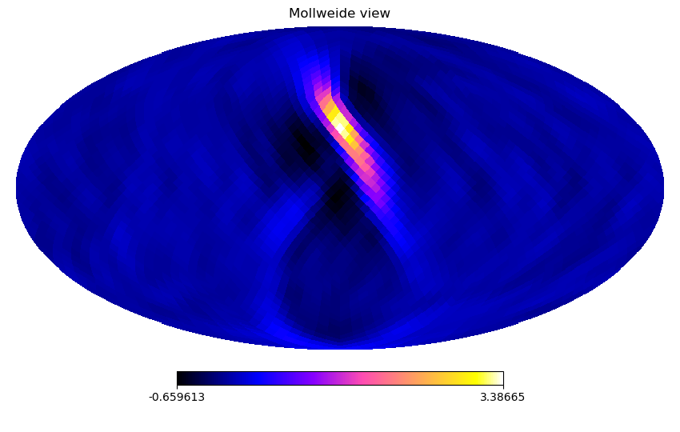

# basic-radiometer
A simple implementation of the GW radiometer algorithm, as presented in [Ballmer2006](https://iopscience.iop.org/article/10.1088/0264-9381/23/8/S23) and [Mitra2008](https://journals.aps.org/prd/abstract/10.1103/PhysRevD.77.042002).

